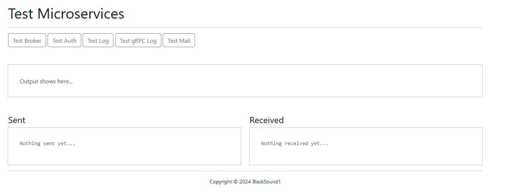
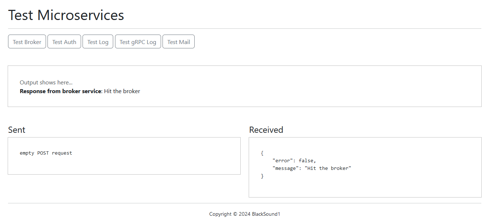

# Go Microservices

Just a project for testing and learning about the microservices architecture. Written in Go.

---

Tests the ability to connect to different microservices. Microservices include:
- Broker: For negotiating connections between microservices
- Front-end: Web-based user interface
- Auth: To test authentication
- Listener: To listen to messages via RabbitMQ
- Logger: For handling logging
- Mail: for sending email using Mailhog
  
# Usage

Click the buttons at the top to initiate different cross-microservice communications. Here is a screenshot after the broker microservice had been accessed:

